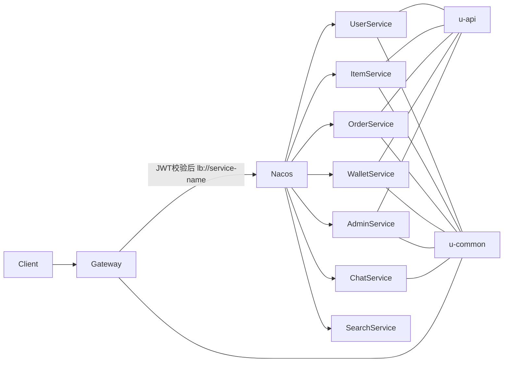

# u-trade

`u-trade` 是一套基于 Spring Boot 3 + Spring Cloud Alibaba + MyBatis-Plus 的二手交易微服务项目。

当前仓库已经按微服务方式拆分为 `gateway`、业务服务、`u-api` 契约层和 `u-common` 公共层，外部请求统一先进入 `gateway`，通过 JWT 校验后，再由 Nacos 服务发现转发到对应服务。

本文档包含：

- 项目架构说明
- 模块职责和启动顺序
- 环境依赖与端口规划
- Nacos 配置中心完整约定
- 数据库建库建表示例
- 本地运行步骤
- 当前代码中的已知限制与建议

## 1. 架构概览



## 2. 模块说明

根工程模块定义见 `pom.xml`：

- `u-common`: 公共模块，放通用常量、统一返回体、JWT 工具、网关/服务间鉴权配置、公共拦截器等
- `u-api`: 微服务之间的 Feign 契约和内部 API 定义
- `gateway`: 网关服务，对外唯一 HTTP 入口
- `user-service`: 用户、收货地址、收藏
- `item-service`: 商品、分类、评价、首页推荐
- `order-service`: 订单、支付、退款、物流、消息日志
- `wallet-service`: 钱包、资金流水、充值、提现
- `admin-service`: 管理员、管理员操作日志
- `chat-service`: 聊天会话、聊天消息
- `search-service`: 搜索服务，可选

### 2.1 分层职责

#### `gateway`

- 对外暴露统一入口
- 负责 JWT 校验
- 把认证后的身份头透传给下游服务
- 通过 `lb://service-name` 走 Nacos 服务发现

#### `u-api`

- 定义微服务内部调用的 API 契约
- 定义 Feign Client
- 不建议在这里放业务实现和数据库实体

#### `u-common`

- 放通用常量、异常、结果包装、上下文、JWT 工具
- 放统一安全组件
  - 网关透传身份校验
  - 服务间 `/inner/**` 内部鉴权
- 放共享配置属性类

## 3. 技术栈

- JDK 17
- Spring Boot 3.3.4
- Spring Cloud 2023.0.1
- Spring Cloud Alibaba 2023.0.1.0
- MyBatis-Plus 3.5.7
- MySQL 8.x
- Nacos 2.x
- Redis 6.x / 7.x
- RabbitMQ 3.x
- Elasticsearch 7.x

## 4. 服务端口规划

| 模块 | 端口 | 说明 |
| --- | --- | --- |
| `gateway` | `8080` | 对外统一入口 |
| `user-service` | `8081` | 用户服务 |
| `chat-service` | `8082` | 聊天服务 |
| `order-service` | `8083` | 订单服务 |
| `search-service` | `8084` | 搜索服务 |
| `wallet-service` | `8085` | 钱包服务 |
| `item-service` | `8086` | 商品服务 |
| `admin-service` | `8087` | 管理服务 |

## 5. 请求链路与安全设计

### 5.1 外部请求链路

1. 客户端请求进入 `gateway`
2. `gateway` 校验 JWT
3. `gateway` 注入透传身份头
4. `gateway` 通过 `lb://service-name` 到 Nacos 找目标服务
5. 服务侧公共拦截器读取身份头并写入 `BaseContext`

### 5.2 服务间调用链路

1. 服务 A 通过 `u-api` 中的 Feign Client 调用服务 B 的 `/inner/**`
2. Feign 自动注入内部认证头 `X-Internal-Auth`
3. 服务 B 的公共拦截器校验内部认证头

### 5.3 当前安全头

- 网关透传头: `X-Gateway-Auth`
- 服务间内部头: `X-Internal-Auth`
- 用户身份头: `CURRENT_ID`
- 角色头: `ROLE`
- 来源头: `SOURCE_TYPE`

### 5.4 网关白名单

当前默认放行路径：

- `/user/login`
- `/admin/login`
- `/user/register`
- `/home/**`
- `/search/**`

## 6. 基础依赖

本项目本地运行至少依赖以下中间件：

| 组件 | 是否必须 | 说明 |
| --- | --- | --- |
| MySQL | 是 | 每个服务独立库 |
| Nacos | 是 | 服务注册与配置中心 |
| Redis | 部分必须 | `user-service`、`item-service`、`wallet-service` 依赖 |
| RabbitMQ | 部分必须 | `user-service`、`item-service`、`order-service`、`wallet-service` 依赖 |
| Elasticsearch | 部分必须 | `item-service`、`search-service` 依赖 |

## 7. 启动顺序

推荐启动顺序：

1. MySQL
2. Nacos
3. Redis
4. RabbitMQ
5. Elasticsearch
6. `user-service`
7. `item-service`
8. `wallet-service`
9. `order-service`
10. `admin-service`
11. `chat-service`
12. `search-service`
13. `gateway`

## 8. Nacos 配置说明

### 8.1 Namespace 与 Group

建议本地环境先使用：

- Namespace: `public`
- Group: `DEFAULT_GROUP`

### 8.2 推荐 Data ID

当前代码已经统一为两层配置导入：

- `shared-application.yml`
- `${spring.application.name}.yml`

因此建议在 Nacos 中创建以下配置：

- `shared-application.yml`
- `gateway.yml`
- `user-service.yml`
- `item-service.yml`
- `order-service.yml`
- `wallet-service.yml`
- `admin-service.yml`
- `chat-service.yml`
- `search-service.yml`

### 8.3 `shared-application.yml` 示例

```yaml
u:
  gateway:
    auth-secret: change-me-gateway-auth-secret
  internal:
    auth-secret: change-me-internal-auth-secret
  jwt:
    admin-secret-key: change-me-admin-jwt-secret
    admin-ttl: 7200000
    admin-token-name: token
    user-secret-key: change-me-user-jwt-secret
    user-ttl: 7200000
    user-token-name: token

management:
  endpoints:
    web:
      exposure:
        include: health,info

logging:
  level:
    root: INFO
    com.u: INFO
```

### 8.4 `gateway.yml` 示例

```yaml
server:
  port: 8080

spring:
  cloud:
    gateway:
      discovery:
        locator:
          enabled: true
          lower-case-service-id: true
      globalcors:
        cors-configurations:
          '[/**]':
            allowedOriginPatterns: "*"
            allowedMethods: "*"
            allowedHeaders: "*"
            allowCredentials: true
            maxAge: 3600
      routes:
        - id: item-service
          uri: lb://item-service
          predicates:
            - Path=/user/item/**,/user/category/**,/user/review/**,/home/**
          order: 10
        - id: order-service
          uri: lb://order-service
          predicates:
            - Path=/user/order/**
          order: 10
        - id: wallet-service
          uri: lb://wallet-service
          predicates:
            - Path=/user/wallet/**
          order: 10
        - id: chat-service
          uri: lb://chat-service
          predicates:
            - Path=/user/chat/**,/user/chat-message/**,/user/chat-conversation/**
          order: 10
        - id: search-service
          uri: lb://search-service
          predicates:
            - Path=/search/**
          order: 10
        - id: admin-service
          uri: lb://admin-service
          predicates:
            - Path=/admin/**,/admin-logs/**
          order: 20
        - id: user-service
          uri: lb://user-service
          predicates:
            - Path=/user/**
          order: 100
```

### 8.5 各服务配置建议

每个服务自己的 `${spring.application.name}.yml` 建议至少包含：

- `server.port`
- `spring.datasource.*`
- `spring.data.redis.*` 或 `spring.rabbitmq.*`
- `spring.elasticsearch.uris`
- 其他本服务特有配置

#### `user-service.yml`

```yaml
server:
  port: 8081

spring:
  datasource:
    driver-class-name: com.mysql.cj.jdbc.Driver
    url: jdbc:mysql://127.0.0.1:3306/user-service?serverTimezone=GMT%2B8&useUnicode=true&characterEncoding=utf-8&allowMultiQueries=true&useSSL=false&allowPublicKeyRetrieval=true
    username: root
    password: root
  data:
    redis:
      host: 127.0.0.1
      port: 6379
  rabbitmq:
    host: 127.0.0.1
    port: 5672
    username: guest
    password: guest
    virtual-host: /
```

#### `item-service.yml`

```yaml
server:
  port: 8086

spring:
  datasource:
    driver-class-name: com.mysql.cj.jdbc.Driver
    url: jdbc:mysql://127.0.0.1:3306/item-service?serverTimezone=GMT%2B8&useUnicode=true&characterEncoding=utf-8&allowMultiQueries=true&useSSL=false&allowPublicKeyRetrieval=true
    username: root
    password: root
  data:
    redis:
      host: 127.0.0.1
      port: 6379
  rabbitmq:
    host: 127.0.0.1
    port: 5672
    username: guest
    password: guest
    virtual-host: /
  elasticsearch:
    uris: http://127.0.0.1:9200
```

#### `order-service.yml`

```yaml
server:
  port: 8083

spring:
  datasource:
    driver-class-name: com.mysql.cj.jdbc.Driver
    url: jdbc:mysql://127.0.0.1:3306/order-service?useUnicode=true&characterEncoding=utf-8&serverTimezone=Asia/Shanghai&useSSL=false
    username: root
    password: root
  rabbitmq:
    host: 127.0.0.1
    port: 5672
    username: guest
    password: guest
    virtual-host: /
```

#### `wallet-service.yml`

```yaml
server:
  port: 8085

spring:
  datasource:
    driver-class-name: com.mysql.cj.jdbc.Driver
    url: jdbc:mysql://127.0.0.1:3306/wallet-service?useUnicode=true&characterEncoding=utf-8&useSSL=false&serverTimezone=Asia/Shanghai
    username: root
    password: root
  data:
    redis:
      host: 127.0.0.1
      port: 6379
  rabbitmq:
    host: 127.0.0.1
    port: 5672
    username: guest
    password: guest
```

#### `admin-service.yml`

```yaml
server:
  port: 8087

spring:
  datasource:
    driver-class-name: com.mysql.cj.jdbc.Driver
    url: jdbc:mysql://127.0.0.1:3306/admin-service?serverTimezone=GMT%2B8&useUnicode=true&characterEncoding=utf-8&allowMultiQueries=true&useSSL=false&allowPublicKeyRetrieval=true
    username: root
    password: root
```

#### `chat-service.yml`

```yaml
server:
  port: 8082

spring:
  datasource:
    driver-class-name: com.mysql.cj.jdbc.Driver
    url: jdbc:mysql://127.0.0.1:3306/chat-service?serverTimezone=GMT%2B8&useUnicode=true&characterEncoding=utf-8&allowMultiQueries=true&useSSL=false&allowPublicKeyRetrieval=true
    username: root
    password: root
```

#### `search-service.yml`

```yaml
server:
  port: 8084

spring:
  elasticsearch:
    uris: http://127.0.0.1:9200

elasticsearch:
  index:
    item: item
```

### 8.6 本地环境变量

建议本地至少提供这些环境变量：

```powershell
$env:NACOS_SERVER_ADDR="127.0.0.1:8848"
$env:NACOS_NAMESPACE="public"
$env:NACOS_GROUP="DEFAULT_GROUP"

$env:GATEWAY_AUTH_SECRET="replace-with-long-random-string"
$env:INTERNAL_AUTH_SECRET="replace-with-long-random-string"

$env:JWT_ADMIN_SECRET="replace-with-long-random-string"
$env:JWT_USER_SECRET="replace-with-long-random-string"

$env:DB_USERNAME="root"
$env:DB_PASSWORD="root"
```

## 9. 数据库初始化

### 9.1 说明

当前仓库 **没有提交官方 `.sql` 建表文件**，下面的 SQL 是依据各服务 `domain/po` 实体类和少量 Mapper XML 推导出的 **推荐初始化脚本**。

如果你后续修改了实体字段，请同步更新 SQL。

### 9.2 建库脚本

```sql
CREATE DATABASE IF NOT EXISTS `admin-service` DEFAULT CHARACTER SET utf8mb4 COLLATE utf8mb4_unicode_ci;
CREATE DATABASE IF NOT EXISTS `user-service` DEFAULT CHARACTER SET utf8mb4 COLLATE utf8mb4_unicode_ci;
CREATE DATABASE IF NOT EXISTS `item-service` DEFAULT CHARACTER SET utf8mb4 COLLATE utf8mb4_unicode_ci;
CREATE DATABASE IF NOT EXISTS `order-service` DEFAULT CHARACTER SET utf8mb4 COLLATE utf8mb4_unicode_ci;
CREATE DATABASE IF NOT EXISTS `wallet-service` DEFAULT CHARACTER SET utf8mb4 COLLATE utf8mb4_unicode_ci;
CREATE DATABASE IF NOT EXISTS `chat-service` DEFAULT CHARACTER SET utf8mb4 COLLATE utf8mb4_unicode_ci;
```

---

### 9.3 `admin-service` 建表

```sql
USE `admin-service`;

CREATE TABLE IF NOT EXISTS `admin` (
  `id` BIGINT PRIMARY KEY AUTO_INCREMENT,
  `username` VARCHAR(64) NOT NULL,
  `password` VARCHAR(255) NOT NULL,
  `nickname` VARCHAR(64),
  `avatar` VARCHAR(255),
  `role` INT NOT NULL DEFAULT 1,
  `status` INT NOT NULL DEFAULT 1,
  `last_login_time` DATETIME,
  `last_login_ip` VARCHAR(64),
  `create_time` DATETIME DEFAULT CURRENT_TIMESTAMP,
  `update_time` DATETIME DEFAULT CURRENT_TIMESTAMP ON UPDATE CURRENT_TIMESTAMP,
  UNIQUE KEY `uk_admin_username` (`username`)
) ENGINE=InnoDB DEFAULT CHARSET=utf8mb4;

CREATE TABLE IF NOT EXISTS `admin_log` (
  `id` BIGINT PRIMARY KEY AUTO_INCREMENT,
  `admin_id` BIGINT NOT NULL,
  `target_id` VARCHAR(64),
  `action` VARCHAR(128) NOT NULL,
  `content` VARCHAR(512),
  `ip` VARCHAR(64),
  `create_time` DATETIME DEFAULT CURRENT_TIMESTAMP,
  KEY `idx_admin_log_admin_id` (`admin_id`)
) ENGINE=InnoDB DEFAULT CHARSET=utf8mb4;
```

---

### 9.4 `user-service` 建表

```sql
USE `user-service`;

CREATE TABLE IF NOT EXISTS `user` (
  `id` BIGINT PRIMARY KEY AUTO_INCREMENT,
  `username` VARCHAR(64) NOT NULL,
  `nickname` VARCHAR(64),
  `password` VARCHAR(255) NOT NULL,
  `phone` VARCHAR(32),
  `avatar` VARCHAR(255),
  `credit_score` INT NOT NULL DEFAULT 100,
  `status` INT NOT NULL DEFAULT 1,
  `create_time` DATETIME DEFAULT CURRENT_TIMESTAMP,
  `update_time` DATETIME DEFAULT CURRENT_TIMESTAMP ON UPDATE CURRENT_TIMESTAMP,
  UNIQUE KEY `uk_user_username` (`username`),
  UNIQUE KEY `uk_user_phone` (`phone`)
) ENGINE=InnoDB DEFAULT CHARSET=utf8mb4;

CREATE TABLE IF NOT EXISTS `user_address` (
  `id` BIGINT PRIMARY KEY AUTO_INCREMENT,
  `user_id` BIGINT NOT NULL,
  `receiver_name` VARCHAR(64) NOT NULL,
  `receiver_phone` VARCHAR(32) NOT NULL,
  `province` VARCHAR(64),
  `city` VARCHAR(64),
  `district` VARCHAR(64),
  `detail_address` VARCHAR(255) NOT NULL,
  `is_default` INT NOT NULL DEFAULT 0,
  `create_time` DATETIME DEFAULT CURRENT_TIMESTAMP,
  `update_time` DATETIME DEFAULT CURRENT_TIMESTAMP ON UPDATE CURRENT_TIMESTAMP,
  KEY `idx_user_address_user_id` (`user_id`)
) ENGINE=InnoDB DEFAULT CHARSET=utf8mb4;

CREATE TABLE IF NOT EXISTS `favorite` (
  `id` BIGINT PRIMARY KEY AUTO_INCREMENT,
  `user_id` BIGINT NOT NULL,
  `item_id` BIGINT NOT NULL,
  `create_time` DATETIME DEFAULT CURRENT_TIMESTAMP,
  UNIQUE KEY `uk_favorite_user_item` (`user_id`, `item_id`)
) ENGINE=InnoDB DEFAULT CHARSET=utf8mb4;
```

---

### 9.5 `item-service` 建表

```sql
USE `item-service`;

CREATE TABLE IF NOT EXISTS `category` (
  `id` INT PRIMARY KEY AUTO_INCREMENT,
  `name` VARCHAR(64) NOT NULL,
  `parent_id` INT NOT NULL DEFAULT 0,
  `level` INT NOT NULL DEFAULT 1,
  `sort` INT NOT NULL DEFAULT 0,
  `create_time` DATETIME DEFAULT CURRENT_TIMESTAMP
) ENGINE=InnoDB DEFAULT CHARSET=utf8mb4;

CREATE TABLE IF NOT EXISTS `item` (
  `id` BIGINT PRIMARY KEY AUTO_INCREMENT,
  `seller_id` BIGINT NOT NULL,
  `title` VARCHAR(128) NOT NULL,
  `description` TEXT,
  `price` DECIMAL(10,2) NOT NULL,
  `original_price` DECIMAL(10,2),
  `category_id` BIGINT,
  `cover` VARCHAR(255),
  `images` TEXT,
  `status` INT NOT NULL DEFAULT 1,
  `audit_status` INT NOT NULL DEFAULT 0,
  `reject_reason` VARCHAR(255),
  `view_count` BIGINT NOT NULL DEFAULT 0,
  `want_count` BIGINT NOT NULL DEFAULT 0,
  `is_deleted` INT NOT NULL DEFAULT 0,
  `create_time` DATETIME DEFAULT CURRENT_TIMESTAMP,
  `update_time` DATETIME DEFAULT CURRENT_TIMESTAMP ON UPDATE CURRENT_TIMESTAMP,
  `is_free_shipping` INT NOT NULL DEFAULT 0,
  `shipping_fee` DECIMAL(10,2) NOT NULL DEFAULT 0.00,
  KEY `idx_item_seller_id` (`seller_id`),
  KEY `idx_item_category_id` (`category_id`),
  KEY `idx_item_status_audit_deleted` (`status`, `audit_status`, `is_deleted`)
) ENGINE=InnoDB DEFAULT CHARSET=utf8mb4;

CREATE TABLE IF NOT EXISTS `review` (
  `id` BIGINT PRIMARY KEY AUTO_INCREMENT,
  `order_id` BIGINT NOT NULL,
  `reviewer_id` BIGINT NOT NULL,
  `reviewee_id` BIGINT NOT NULL,
  `role` INT NOT NULL,
  `score` INT NOT NULL,
  `content` VARCHAR(1000),
  `is_anonymous` INT NOT NULL DEFAULT 0,
  `create_time` DATETIME DEFAULT CURRENT_TIMESTAMP,
  KEY `idx_review_order_id` (`order_id`)
) ENGINE=InnoDB DEFAULT CHARSET=utf8mb4;
```

#### 兼容性说明: `item-service` 的推荐 SQL

当前 `item-service` 的推荐查询会执行：

```sql
LEFT JOIN user u ON i.seller_id = u.id
```

这和“严格的一服务一数据库”存在冲突。你有两个选择：

1. **推荐做法**：后续把推荐逻辑改为读用户投影表或通过 API / 缓存取信用分
2. **兼容当前代码**：在 `item-service` 库中额外准备一个只读投影表

兼容表可先这样建：

```sql
USE `item-service`;

CREATE TABLE IF NOT EXISTS `user` (
  `id` BIGINT PRIMARY KEY,
  `credit_score` INT NOT NULL DEFAULT 100
) ENGINE=InnoDB DEFAULT CHARSET=utf8mb4;
```

---

### 9.6 `order-service` 建表

```sql
USE `order-service`;

CREATE TABLE IF NOT EXISTS `order` (
  `id` BIGINT PRIMARY KEY AUTO_INCREMENT,
  `order_no` VARCHAR(64) NOT NULL,
  `buyer_id` BIGINT NOT NULL,
  `seller_id` BIGINT NOT NULL,
  `item_id` BIGINT NOT NULL,
  `price` DECIMAL(10,2) NOT NULL,
  `quantity` INT NOT NULL DEFAULT 1,
  `total_price` DECIMAL(10,2) NOT NULL,
  `status` INT NOT NULL DEFAULT 0,
  `created_at` DATETIME DEFAULT CURRENT_TIMESTAMP,
  `paid_at` DATETIME,
  `completed_at` DATETIME,
  `cancelled_at` DATETIME,
  `receiver_name` VARCHAR(64),
  `receiver_phone` VARCHAR(32),
  `receiver_province` VARCHAR(64),
  `receiver_city` VARCHAR(64),
  `receiver_district` VARCHAR(64),
  `receiver_address` VARCHAR(255),
  `shipping_fee` DECIMAL(10,2) DEFAULT 0.00,
  `shipment_id` BIGINT,
  `payment_method` VARCHAR(32),
  `item_snapshot` JSON,
  `updated_at` DATETIME DEFAULT CURRENT_TIMESTAMP ON UPDATE CURRENT_TIMESTAMP,
  `version` INT NOT NULL DEFAULT 0,
  `shipped_at` DATETIME,
  `cancel_reason` VARCHAR(255),
  UNIQUE KEY `uk_order_order_no` (`order_no`),
  KEY `idx_order_buyer_id` (`buyer_id`),
  KEY `idx_order_seller_id` (`seller_id`),
  KEY `idx_order_item_id` (`item_id`)
) ENGINE=InnoDB DEFAULT CHARSET=utf8mb4;

CREATE TABLE IF NOT EXISTS `payment` (
  `id` BIGINT PRIMARY KEY AUTO_INCREMENT,
  `order_no` VARCHAR(64) NOT NULL,
  `payment_no` VARCHAR(64),
  `user_id` BIGINT NOT NULL,
  `amount` DECIMAL(10,2) NOT NULL,
  `method` INT NOT NULL,
  `status` INT NOT NULL DEFAULT 0,
  `transaction_id` VARCHAR(128),
  `paid_at` DATETIME,
  `created_at` DATETIME DEFAULT CURRENT_TIMESTAMP,
  `update_time` DATETIME DEFAULT CURRENT_TIMESTAMP ON UPDATE CURRENT_TIMESTAMP,
  KEY `idx_payment_order_no` (`order_no`)
) ENGINE=InnoDB DEFAULT CHARSET=utf8mb4;

CREATE TABLE IF NOT EXISTS `refund` (
  `id` BIGINT PRIMARY KEY AUTO_INCREMENT,
  `order_id` BIGINT NOT NULL,
  `refund_no` VARCHAR(64) NOT NULL,
  `amount` DECIMAL(10,2) NOT NULL,
  `type` INT NOT NULL,
  `reason` VARCHAR(255),
  `evidence_images` TEXT,
  `status` INT NOT NULL DEFAULT 0,
  `out_refund_no` VARCHAR(128),
  `created_at` DATETIME DEFAULT CURRENT_TIMESTAMP,
  `processed_at` DATETIME,
  `reject_reason` VARCHAR(255),
  UNIQUE KEY `uk_refund_refund_no` (`refund_no`),
  KEY `idx_refund_order_id` (`order_id`)
) ENGINE=InnoDB DEFAULT CHARSET=utf8mb4;

CREATE TABLE IF NOT EXISTS `refund_record` (
  `id` BIGINT PRIMARY KEY AUTO_INCREMENT,
  `user_id` BIGINT NOT NULL,
  `transaction_id` BIGINT NOT NULL,
  `amount` DECIMAL(10,2) NOT NULL,
  `status` INT NOT NULL DEFAULT 0,
  `pay_channel` INT NOT NULL,
  `create_time` DATETIME DEFAULT CURRENT_TIMESTAMP,
  `update_time` DATETIME DEFAULT CURRENT_TIMESTAMP ON UPDATE CURRENT_TIMESTAMP
) ENGINE=InnoDB DEFAULT CHARSET=utf8mb4;

CREATE TABLE IF NOT EXISTS `shipment` (
  `id` BIGINT PRIMARY KEY AUTO_INCREMENT,
  `order_id` BIGINT NOT NULL,
  `seller_id` BIGINT NOT NULL,
  `company` VARCHAR(64),
  `tracking_no` VARCHAR(64),
  `receiver_name` VARCHAR(64),
  `receiver_phone` VARCHAR(32),
  `receiver_province` VARCHAR(64),
  `receiver_city` VARCHAR(64),
  `receiver_district` VARCHAR(64),
  `receiver_address` VARCHAR(255),
  `status` INT NOT NULL DEFAULT 0,
  `shipped_at` DATETIME,
  `delivered_at` DATETIME,
  `created_at` DATETIME DEFAULT CURRENT_TIMESTAMP,
  `update_time` DATETIME DEFAULT CURRENT_TIMESTAMP ON UPDATE CURRENT_TIMESTAMP,
  KEY `idx_shipment_order_id` (`order_id`)
) ENGINE=InnoDB DEFAULT CHARSET=utf8mb4;

CREATE TABLE IF NOT EXISTS `mq_message_log` (
  `id` BIGINT PRIMARY KEY AUTO_INCREMENT,
  `message_id` VARCHAR(64) NOT NULL,
  `exchange` VARCHAR(128),
  `routing_key` VARCHAR(128),
  `message_body` TEXT,
  `status` INT NOT NULL DEFAULT 0,
  `retry_count` INT NOT NULL DEFAULT 0,
  `error_reason` VARCHAR(255),
  `create_time` DATETIME DEFAULT CURRENT_TIMESTAMP,
  `update_time` DATETIME DEFAULT CURRENT_TIMESTAMP ON UPDATE CURRENT_TIMESTAMP,
  UNIQUE KEY `uk_mq_message_id` (`message_id`)
) ENGINE=InnoDB DEFAULT CHARSET=utf8mb4;

CREATE TABLE IF NOT EXISTS `transaction_record` (
  `id` BIGINT PRIMARY KEY AUTO_INCREMENT,
  `buyer_id` BIGINT NOT NULL,
  `seller_id` BIGINT NOT NULL,
  `order_id` BIGINT NOT NULL,
  `amount` DECIMAL(10,2) NOT NULL,
  `pay_type` INT NOT NULL,
  `status` INT NOT NULL DEFAULT 0,
  `create_time` DATETIME DEFAULT CURRENT_TIMESTAMP,
  `update_time` DATETIME DEFAULT CURRENT_TIMESTAMP ON UPDATE CURRENT_TIMESTAMP,
  KEY `idx_transaction_order_id` (`order_id`)
) ENGINE=InnoDB DEFAULT CHARSET=utf8mb4;
```

---

### 9.7 `wallet-service` 建表

```sql
USE `wallet-service`;

CREATE TABLE IF NOT EXISTS `user_wallet` (
  `id` BIGINT PRIMARY KEY AUTO_INCREMENT,
  `user_id` BIGINT NOT NULL,
  `balance` DECIMAL(12,2) NOT NULL DEFAULT 0.00,
  `status` INT NOT NULL DEFAULT 1,
  `frozen_amount` DECIMAL(12,2) NOT NULL DEFAULT 0.00,
  `total_income` DECIMAL(12,2) NOT NULL DEFAULT 0.00,
  `total_expense` DECIMAL(12,2) NOT NULL DEFAULT 0.00,
  `version` INT NOT NULL DEFAULT 0,
  `create_time` DATETIME DEFAULT CURRENT_TIMESTAMP,
  `update_time` DATETIME DEFAULT CURRENT_TIMESTAMP ON UPDATE CURRENT_TIMESTAMP,
  UNIQUE KEY `uk_user_wallet_user_id` (`user_id`)
) ENGINE=InnoDB DEFAULT CHARSET=utf8mb4;

CREATE TABLE IF NOT EXISTS `wallet_log` (
  `id` BIGINT PRIMARY KEY AUTO_INCREMENT,
  `user_id` BIGINT NOT NULL,
  `wallet_id` BIGINT NOT NULL,
  `biz_type` INT NOT NULL,
  `amount` DECIMAL(12,2) NOT NULL,
  `balance_before` DECIMAL(12,2),
  `balance_after` DECIMAL(12,2),
  `frozen_before` DECIMAL(12,2),
  `frozen_after` DECIMAL(12,2),
  `biz_order_no` VARCHAR(64),
  `description` VARCHAR(255),
  `create_time` DATETIME DEFAULT CURRENT_TIMESTAMP,
  KEY `idx_wallet_log_user_id` (`user_id`),
  KEY `idx_wallet_log_wallet_id` (`wallet_id`)
) ENGINE=InnoDB DEFAULT CHARSET=utf8mb4;

CREATE TABLE IF NOT EXISTS `wallet_recharge` (
  `id` BIGINT PRIMARY KEY AUTO_INCREMENT,
  `user_id` BIGINT NOT NULL,
  `amount` DECIMAL(12,2) NOT NULL,
  `biz_order_no` VARCHAR(64) NOT NULL,
  `status` INT NOT NULL DEFAULT 0,
  `pay_channel` INT NOT NULL,
  `pay_time` DATETIME,
  `create_time` DATETIME DEFAULT CURRENT_TIMESTAMP,
  `update_time` DATETIME DEFAULT CURRENT_TIMESTAMP ON UPDATE CURRENT_TIMESTAMP,
  UNIQUE KEY `uk_wallet_recharge_biz_order_no` (`biz_order_no`)
) ENGINE=InnoDB DEFAULT CHARSET=utf8mb4;

CREATE TABLE IF NOT EXISTS `wallet_withdraw` (
  `id` BIGINT PRIMARY KEY AUTO_INCREMENT,
  `user_id` BIGINT NOT NULL,
  `amount` DECIMAL(12,2) NOT NULL,
  `biz_order_no` VARCHAR(64) NOT NULL,
  `status` INT NOT NULL DEFAULT 0,
  `pay_channel` INT NOT NULL,
  `pay_time` DATETIME,
  `create_time` DATETIME DEFAULT CURRENT_TIMESTAMP,
  `update_time` DATETIME DEFAULT CURRENT_TIMESTAMP ON UPDATE CURRENT_TIMESTAMP,
  UNIQUE KEY `uk_wallet_withdraw_biz_order_no` (`biz_order_no`)
) ENGINE=InnoDB DEFAULT CHARSET=utf8mb4;

CREATE TABLE IF NOT EXISTS `transaction_record` (
  `id` BIGINT PRIMARY KEY AUTO_INCREMENT,
  `buyer_id` BIGINT NOT NULL,
  `seller_id` BIGINT NOT NULL,
  `order_id` BIGINT NOT NULL,
  `amount` DECIMAL(10,2) NOT NULL,
  `pay_type` INT NOT NULL,
  `status` INT NOT NULL DEFAULT 0,
  `create_time` DATETIME DEFAULT CURRENT_TIMESTAMP,
  `update_time` DATETIME DEFAULT CURRENT_TIMESTAMP ON UPDATE CURRENT_TIMESTAMP,
  KEY `idx_wallet_transaction_order_id` (`order_id`)
) ENGINE=InnoDB DEFAULT CHARSET=utf8mb4;
```

---

### 9.8 `chat-service` 建表

```sql
USE `chat-service`;

CREATE TABLE IF NOT EXISTS `chat_conversation` (
  `id` BIGINT PRIMARY KEY AUTO_INCREMENT,
  `buyer_id` BIGINT NOT NULL,
  `seller_id` BIGINT NOT NULL,
  `item_id` BIGINT NOT NULL,
  `create_time` DATETIME DEFAULT CURRENT_TIMESTAMP,
  `last_msg_time` DATETIME,
  `unread_count` INT NOT NULL DEFAULT 0,
  KEY `idx_chat_conversation_buyer_id` (`buyer_id`),
  KEY `idx_chat_conversation_seller_id` (`seller_id`),
  KEY `idx_chat_conversation_item_id` (`item_id`)
) ENGINE=InnoDB DEFAULT CHARSET=utf8mb4;

CREATE TABLE IF NOT EXISTS `chat_message` (
  `id` BIGINT PRIMARY KEY AUTO_INCREMENT,
  `conversation_id` BIGINT NOT NULL,
  `sender_id` BIGINT NOT NULL,
  `content` TEXT,
  `type` INT NOT NULL DEFAULT 1,
  `status` INT NOT NULL DEFAULT 0,
  `create_time` DATETIME DEFAULT CURRENT_TIMESTAMP,
  KEY `idx_chat_message_conversation_id` (`conversation_id`)
) ENGINE=InnoDB DEFAULT CHARSET=utf8mb4;
```

## 10. Gateway 路由说明

当前网关显式路由如下：

| 路径前缀 | 目标服务 |
| --- | --- |
| `/user/item/**` | `item-service` |
| `/user/category/**` | `item-service` |
| `/user/review/**` | `item-service` |
| `/home/**` | `item-service` |
| `/user/order/**` | `order-service` |
| `/user/wallet/**` | `wallet-service` |
| `/user/chat/**` | `chat-service` |
| `/user/chat-message/**` | `chat-service` |
| `/user/chat-conversation/**` | `chat-service` |
| `/search/**` | `search-service` |
| `/admin/**` | `admin-service` |
| `/admin-logs/**` | `admin-service` |
| `/user/**` | `user-service` |

## 11. 本地运行命令

### 11.1 编译整个项目

```bash
mvn clean compile -DskipTests
```

### 11.2 单服务启动示例

```bash
mvn -pl gateway spring-boot:run
mvn -pl user-service spring-boot:run
mvn -pl item-service spring-boot:run
```

或者直接在 IDE 中运行各模块的 `*Application` 主类。

## 12. 推荐联调顺序

### 12.1 登录链路

1. 启动 `user-service`
2. 启动 `gateway`
3. 通过 `POST /user/login` 获取 token
4. 带 token 访问 `GET /user/me`

### 12.2 下单链路

1. 启动 `user-service`
2. 启动 `item-service`
3. 启动 `wallet-service`
4. 启动 `order-service`
5. 启动 `gateway`
6. 通过网关完成登录、商品查询、下单、支付

## 13. 当前项目已知注意点

### 13.1 `item-service` 推荐 SQL 存在跨库耦合痕迹

`item-service` 的 `ItemMapper.xml` 里首页推荐查询使用了：

```sql
LEFT JOIN user u ON i.seller_id = u.id
```

严格按微服务边界，这不应该直接依赖另一个服务的用户表。当前 README 已给出兼容性建表方案，但更推荐后续重构为：

- 用户信用分投影表
- API 查询 + 缓存
- MQ 同步读模型

### 13.2 中间件地址默认值存在不一致

当前仓库里有些服务默认指向 `127.0.0.1`，有些是 `192.168.150.101`。正式使用时建议统一通过 Nacos 管理。

### 13.3 没有官方 SQL 文件

当前 README 中的 SQL 是基于代码推导的推荐初始化脚本，建议你后续单独沉淀为：

- `docs/sql/admin-service.sql`
- `docs/sql/user-service.sql`
- `docs/sql/item-service.sql`
- `docs/sql/order-service.sql`
- `docs/sql/wallet-service.sql`
- `docs/sql/chat-service.sql`

## 14. 建议后续优化

1. 把数据库初始化脚本单独抽到 `docs/sql/`
2. 把 Nacos 配置样例单独抽到 `docs/nacos/`
3. 解决 `item-service` 对 `user` 表的推荐查询耦合
4. 对 `u-api` 再拆一层轻量 DTO 模块，减少对 `u-common` 的直接依赖
5. 增加 `docker-compose.yml` 或本地一键启动说明
